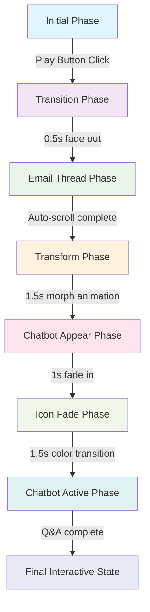

# EmailAnalyzer Animation Flow Design

## 1. Animation Phase Architecture

Based on the Hero component pattern, the EmailAnalyzer will have 7 distinct phases:

```typescript
export type EmailAnalyzerPhase = 
  | 'initial'           // Centered text with play button
  | 'transition'        // Text/button fade out
  | 'emailThread'       // Email thread appears and auto-scrolls
  | 'transform'         // Thread shrinks and transforms to Gmail icon
  | 'chatbotAppear'     // Chatbot appears behind Gmail icon with muted colors
  | 'iconFade'          // Gmail icon shrinks and disappears, chatbot colors become vivid
  | 'chatbotActive'     // Chatbot with auto-typed questions and answers
```

### Phase Details:

#### Phase 1: Initial
- **Duration**: Infinite until user interaction
- **Content**: Centered "Analizador de Hilos de Email" text, description, and play button
- **Animation**: Bounce animation on play button hover
- **User Interaction**: Play button click triggers next phase

#### Phase 2: Transition
- **Duration**: 0.5s
- **Content**: Fade out animation of initial text and button
- **Animation**: Opacity transition from 1 to 0
- **Auto-advance**: To emailThread phase

#### Phase 3: Email Thread
- **Duration**: 8-10s (depending on content length)
- **Content**: 10 Gmail-formatted emails in thread format
- **Animation**: Auto-scroll from top to bottom at perceptible but fast speed
- **Auto-advance**: To transform phase after scrolling completes

#### Phase 4: Transform
- **Duration**: 1.5s
- **Content**: Thread content shrinks/contracts and transforms into Gmail icon
- **Animation**: Scale and shape morphing animation
- **Auto-advance**: To chatbotAppear phase

#### Phase 5: Chatbot Appear
- **Duration**: 1s
- **Content**: Gmail icon with muted chatbot appearing behind
- **Animation**: Chatbot fades in with muted colors behind Gmail icon
- **Auto-advance**: To iconFade phase

#### Phase 6: Icon Fade
- **Duration**: 1.5s
- **Content**: Gmail icon becomes smaller and disappears while chatbot colors become vivid
- **Animation**: Icon scale down to 0, chatbot color saturation increase
- **Auto-advance**: To chatbotActive phase

#### Phase 7: Chatbot Active
- **Duration**: 15-20s (for Q&A sequence)
- **Content**: Chatbot with 3 automatically typed questions and answers
- **Animation**: Typing animation for questions and answers
- **Final State**: Interactive chatbot with placeholder URL in third response

## 2. Component Breakdown with Responsibilities

### Main Components:

#### EmailAnalyzer.tsx (Main Container)
- **Responsibility**: Orchestrate all animation phases and component rendering
- **Size**: ~150 lines
- **Dependencies**: useEmailAnalyzerAnimation hook, all sub-components

#### Components/InitialScreen.tsx
- **Responsibility**: Render initial state with title, description, and play button
- **Size**: ~80 lines
- **Animations**: Bounce effect on button hover using framer-motion

#### Components/EmailThreadViewer.tsx
- **Responsibility**: Display Gmail-formatted email thread with auto-scroll
- **Size**: ~150 lines
- **Animations**: Smooth auto-scroll animation using framer-motion

#### Components/GmailIcon.tsx
- **Responsibility**: Render Gmail icon that appears during transformation
- **Size**: ~60 lines
- **Animations**: Scale and morphing animations

#### Components/AnimatedChatbot.tsx
- **Responsibility**: Chatbot with color transitions and auto-typing
- **Size**: ~180 lines
- **Animations**: Color saturation changes, typing animation for Q&A

#### Components/PlayButton.tsx
- **Responsibility**: Interactive play button with bounce animation
- **Size**: ~50 lines
- **Animations**: Hover bounce effect using framer-motion

### Supporting Components:

#### Components/EmailMessage.tsx
- **Responsibility**: Individual email message in Gmail format
- **Size**: ~100 lines
- **Animations**: Fade-in animation as message appears during scroll

#### Components/TypingIndicator.tsx
- **Responsibility**: Typing animation for chatbot messages
- **Size**: ~60 lines
- **Animations**: Typing dots animation

## 3. File Structure within EmailAnalyzer Directory

```
src/components/sections/EmailAnalyzer/
├── EmailAnalyzer.tsx                    # Main container (orchestrator)
├── Components/
│   ├── InitialScreen.tsx               # Initial state with play button
│   ├── PlayButton.tsx                  # Animated play button
│   ├── EmailThreadViewer.tsx           # Gmail thread with auto-scroll
│   ├── EmailMessage.tsx                # Individual email message
│   ├── GmailIcon.tsx                   # Gmail icon for transformation
│   ├── AnimatedChatbot.tsx             # Chatbot with color transitions
│   └── TypingIndicator.tsx             # Typing animation component
├── Handlers/
│   ├── useEmailAnalyzerAnimation.ts    # Main animation control hook
│   ├── useEmailScroll.ts               # Email auto-scroll logic
│   ├── useTypingAnimation.ts           # Chatbot typing animation
│   └── useColorTransition.ts           # Chatbot color transitions
├── Models/
│   ├── animationPhases.ts              # Phase definitions and transitions
│   ├── emailThreadsData.ts             # Email thread data (existing)
│   ├── chatbotData.ts                  # Chatbot Q&A data
│   └── animationConfig.ts              # Timing and configuration
├── Styles/
│   ├── EmailAnalyzerStyles.ts          # Main styles (existing)
│   ├── InitialScreenStyles.ts          # Initial screen styles
│   ├── EmailThreadStyles.ts            # Gmail thread styles
│   ├── ChatbotStyles.ts                # Chatbot styles
│   └── AnimationStyles.ts              # Animation-specific styles
└── Utils/
    ├── animationHelpers.ts             # Animation utility functions
    └── gmailFormatter.ts               # Email formatting utilities
```

## 4. Animation Flow Diagram with Phase Transitions



### Phase Transition Logic:

1. **Initial → Transition**: User clicks play button
2. **Transition → EmailThread**: Automatic after 0.5s
3. **EmailThread → Transform**: Automatic after scroll completes
4. **Transform → ChatbotAppear**: Automatic after 1.5s
5. **ChatbotAppear → IconFade**: Automatic after 1s
6. **IconFade → ChatbotActive**: Automatic after 1.5s
7. **ChatbotActive → Final**: Automatic after Q&A sequence completes

## 5. Data Models for Email Threads and Chatbot

### Email Thread Models (extending existing):

```typescript
// Enhanced email model for animation
export interface AnimatedEmail extends Email {
  animationDelay: number;    // Delay before appearing in scroll
  scrollPosition: number;    // Position in scroll timeline
  avatar: string;            // Avatar initials
  quotedText?: string;       // Quoted email content
}

// Thread animation configuration
export interface ThreadAnimationConfig {
  totalDuration: number;     // Total scroll duration (ms)
  scrollSpeed: number;       // Pixels per second
  messageDelay: number;      // Delay between messages
  easing: string;            // Scroll easing function
}
```

### Chatbot Models:

```typescript
// Chatbot message for animation
export interface ChatbotMessage {
  id: string;
  text: string;
  isUser: boolean;
  typingSpeed: number;       // Characters per second
  delayBefore: number;       // Delay before typing starts
  placeholderUrl?: string;   // URL placeholder in third response
}

// Chatbot animation state
export interface ChatbotAnimationState {
  currentMessageIndex: number;
  isTyping: boolean;
  colorSaturation: number;   // 0-100, for color transition
  isVisible: boolean;
  scale: number;             // For icon transformation
}

// Predefined Q&A sequence
export interface ChatbotQA {
  question: ChatbotMessage;
  answer: ChatbotMessage;
  delayAfter: number;        // Delay before next question
}
```

### Animation Configuration Models:

```typescript
// Phase timing configuration
export interface PhaseTiming {
  [key: string]: {
    duration: number;
    autoAdvance: boolean;
    easing?: string;
  };
}

// Animation transition configuration
export interface AnimationTransition {
  from: EmailAnalyzerPhase;
  to: EmailAnalyzerPhase;
  duration: number;
  animation: string;
  easing?: string;
}
```

## 6. Handler Hooks for Animation Control

### Main Animation Hook:

```typescript
// useEmailAnalyzerAnimation.ts
export interface UseEmailAnalyzerAnimationReturn {
  phase: EmailAnalyzerPhase;
  isAnimating: boolean;
  progress: number;          // 0-100 progress through current phase
  startAnimation: () => void;
  resetAnimation: () => void;
  phaseConfig: PhaseTiming;
}

export const useEmailAnalyzerAnimation = (): UseEmailAnalyzerAnimationReturn;
```

### Specialized Hooks:

```typescript
// useEmailScroll.ts
export interface UseEmailScrollReturn {
  scrollPosition: number;
  isScrolling: boolean;
  startAutoScroll: () => void;
  pauseScroll: () => void;
  visibleMessages: number[];
}

// useTypingAnimation.ts
export interface UseTypingAnimationReturn {
  currentText: string;
  isTyping: boolean;
  startTyping: (text: string, speed: number) => void;
  typedCharacters: number;
}

// useColorTransition.ts
export interface UseColorTransitionReturn {
  saturation: number;
  brightness: number;
  startTransition: (from: number, to: number, duration: number) => void;
  currentColors: ChatbotColors;
}
```

## 7. Implementation Considerations

### Performance Optimizations:
- Use `useMemo` for expensive calculations
- Implement proper cleanup in useEffect hooks
- Use CSS transforms instead of layout properties for animations
- Lazy load email messages as they come into view

### Accessibility:
- Add ARIA labels for animation states
- Provide keyboard navigation for play button
- Include reduced motion preferences support
- Add screen reader announcements for phase changes

### Error Handling:
- Implement fallback animations if framer-motion fails
- Add retry logic for animation sequences
- Provide visual feedback for animation errors
- Log animation performance metrics

### Browser Compatibility:
- Test animations across different browsers
- Implement fallbacks for older browsers
- Use appropriate prefixes for CSS animations
- Optimize for mobile performance

This design provides a modular, maintainable architecture that follows the established patterns in the codebase while keeping files under the 200-line limit and ensuring proper separation of concerns.